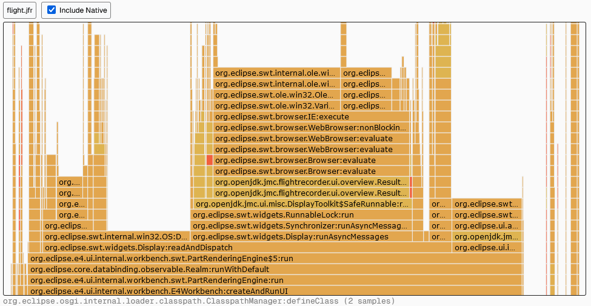

<h1>♨️ JfrView</h1>

One-Click Flamegraph Visualization for JFR Files, even in the Browser

<picture>
    
</picture>

## Features

- Directly open JFR files
- View JFR files in your browser
- Selectively hide/show native frames

## Usage

1. Open <url>
2. Drag'n'Drop your JFR file into the black rectangle
3. Profit

## License

This project is licensed under the MIT license. See the [LICENSE](LICENSE) file for more information.
